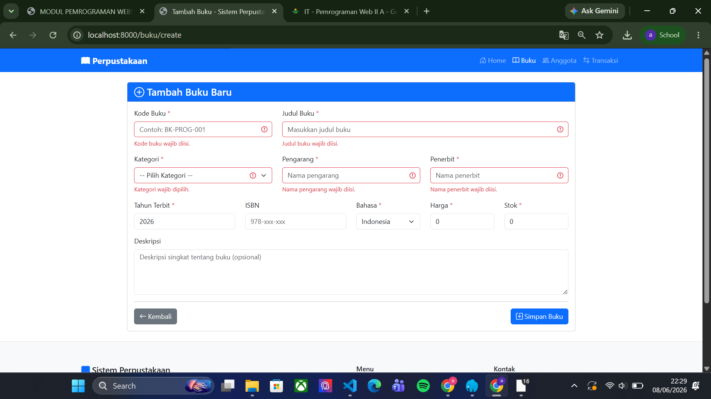
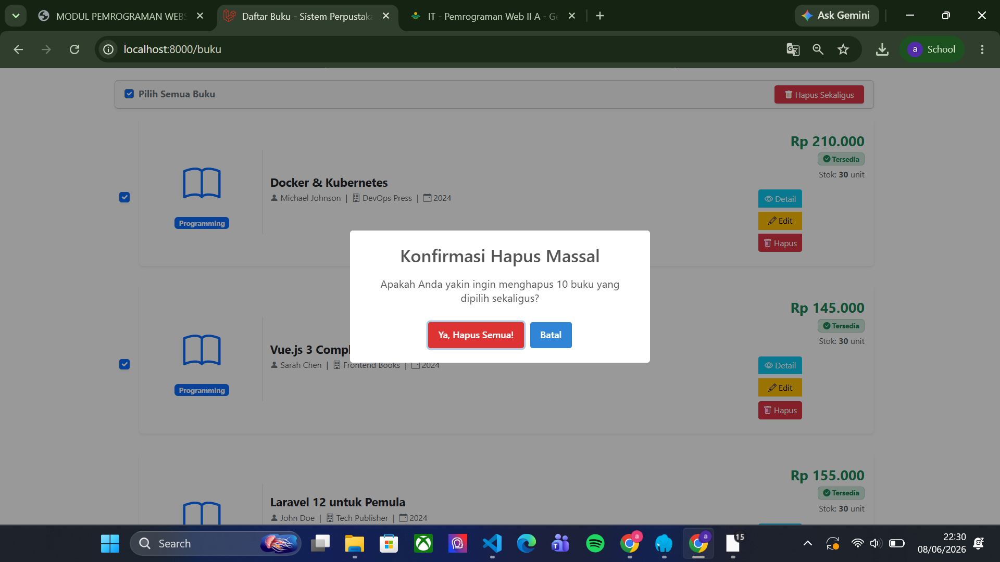
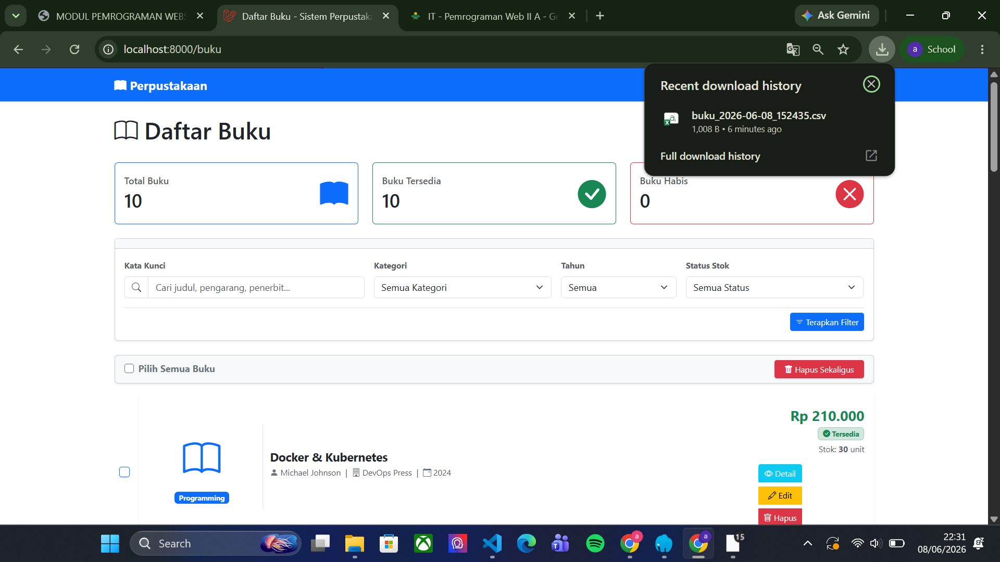

# Tugas Pemrograman Web II Pertemuan 12

## Identitas

* Nama: Arum Rahma Putri Sabrina
* NIM: 60324028
* Mata Kuliah: Pemrograman Web 2 (A)

---

# Tugas 1 - Validation Rules Advanced

## Fitur yang dibuat

### Custom Validation Rule untuk Kode Buku

Format kode buku:

```text id="o50i4h"
BK-[kategori singkat]-[nomor]
```

Contoh:

```text id="5ct2pd"
BK-PROG-001
BK-DB-002
BK-WEB-010
```

### Validation yang diterapkan

* Kode buku wajib diisi
* Format kode buku harus sesuai aturan
* Menggunakan custom validation rule Laravel

---

## Gambar Tugas 1




---

# Tugas 2 - Bulk Delete Operations

## Fitur yang dibuat

### Delete Multiple Buku

User dapat menghapus beberapa data buku sekaligus menggunakan checkbox.

---

## Fitur pada Halaman Index Buku

### Checkbox per Buku

Digunakan untuk memilih buku yang akan dihapus.

### Select All Checkbox

Digunakan untuk memilih seluruh data buku sekaligus.

### Button Bulk Delete

Digunakan untuk menghapus semua buku yang dipilih.

---

## Gambar Tugas 2




---

# Tugas 3 - Export Buku ke CSV

## Fitur yang dibuat

### Export Data Buku ke CSV

User dapat mengunduh seluruh data buku dalam format CSV.

---

## Fitur pada Halaman Index

### Button Export CSV

Button digunakan untuk download file CSV.

---

### Data yang di-export

* Kode Buku
* Judul
* Kategori
* Pengarang
* Penerbit
* Tahun Terbit
* ISBN
* Harga
* Stok

---

## Gambar Tugas 3




