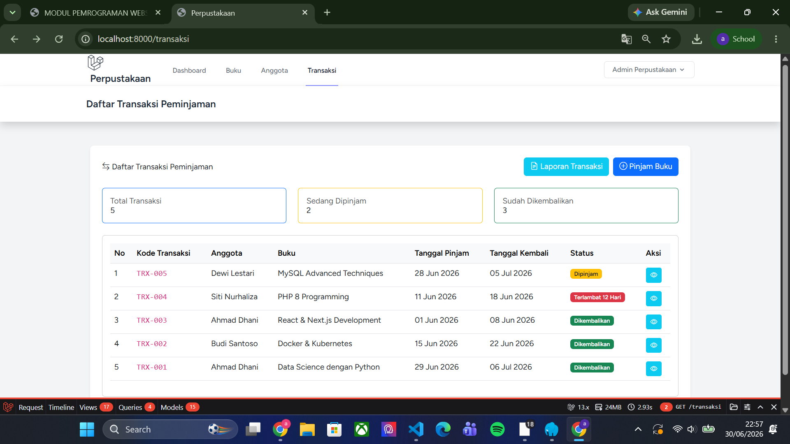
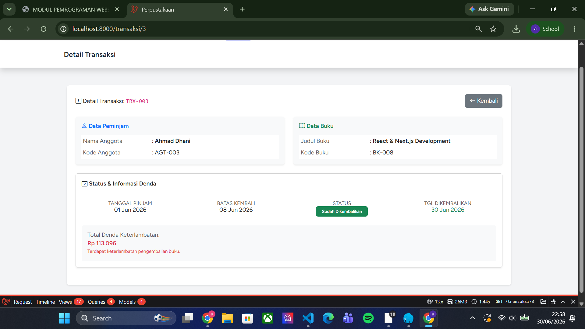
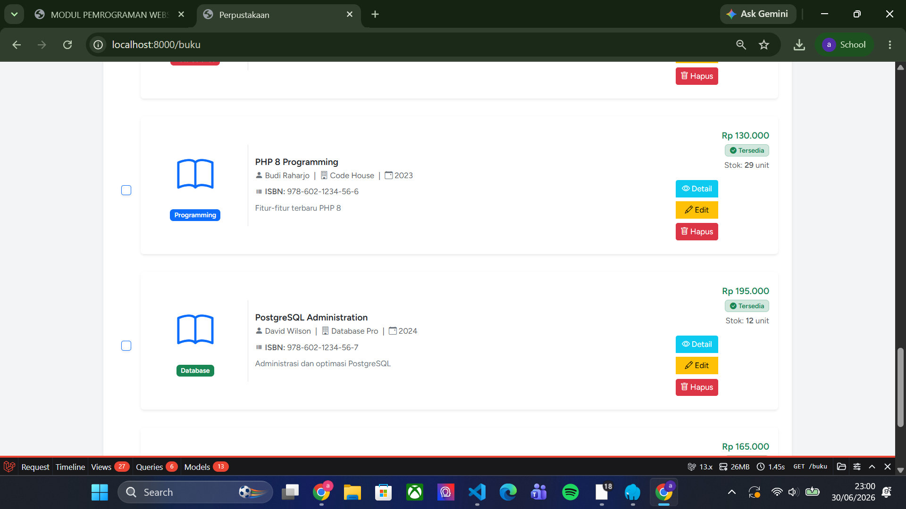
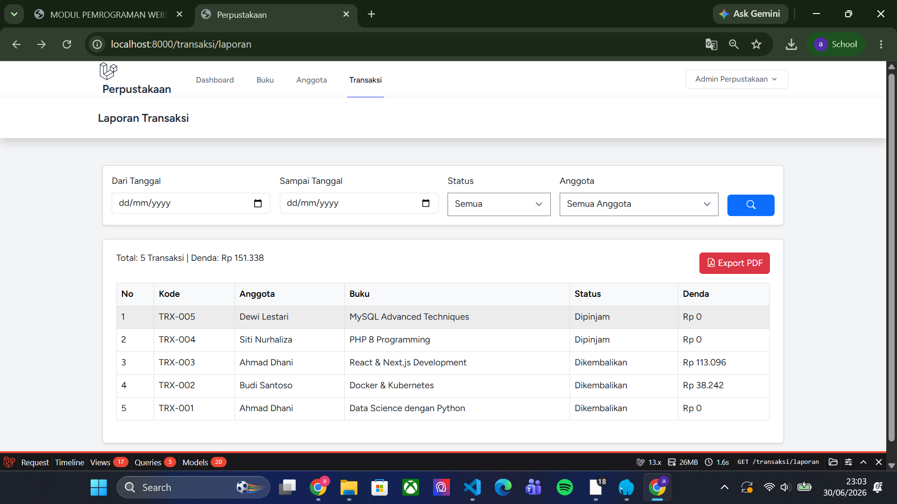
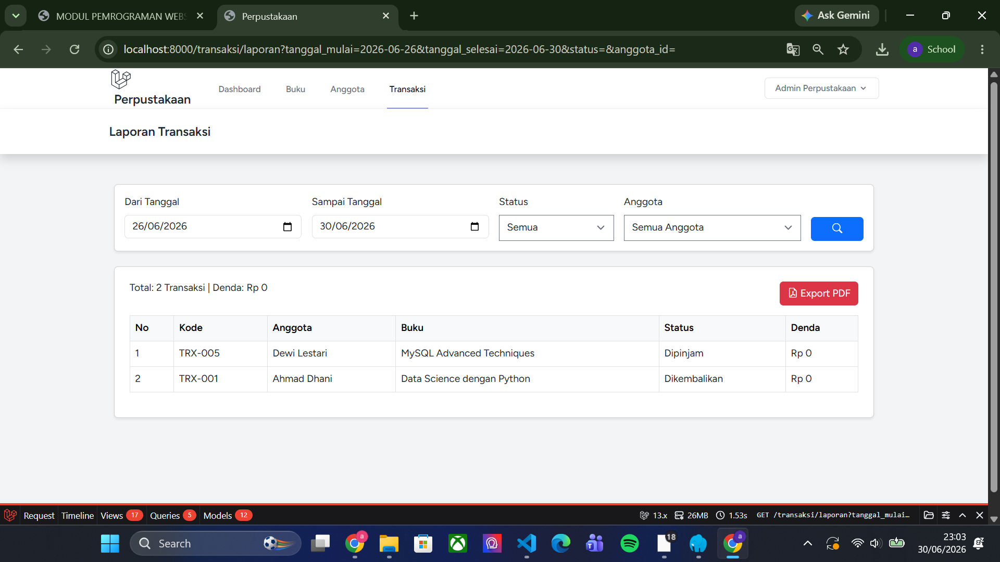
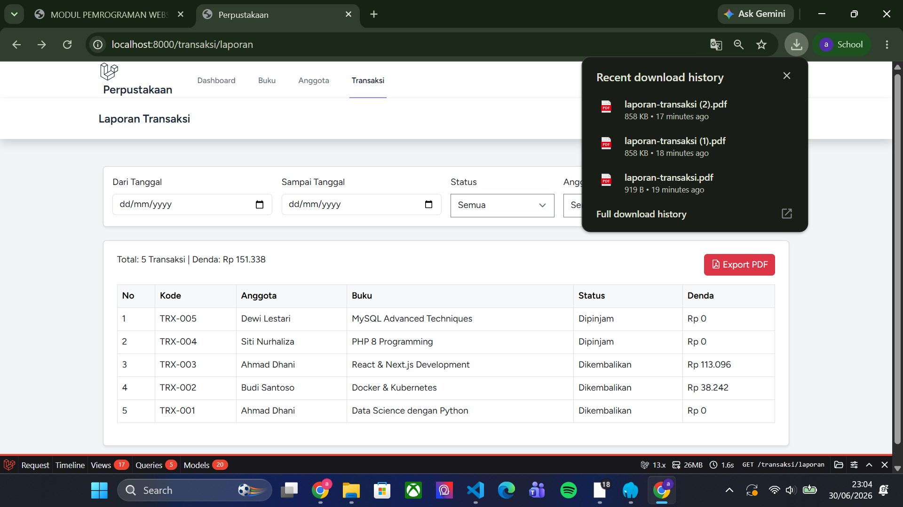
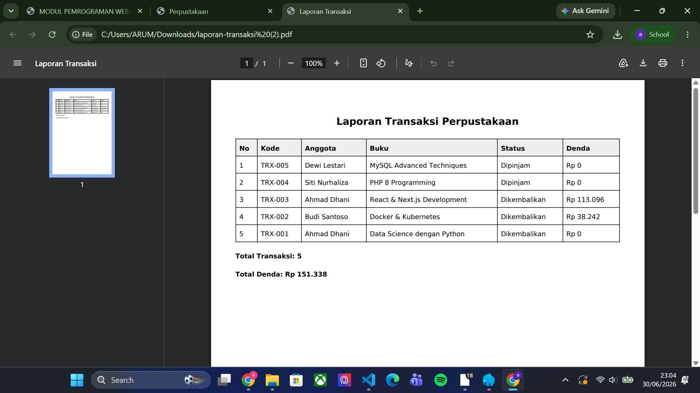
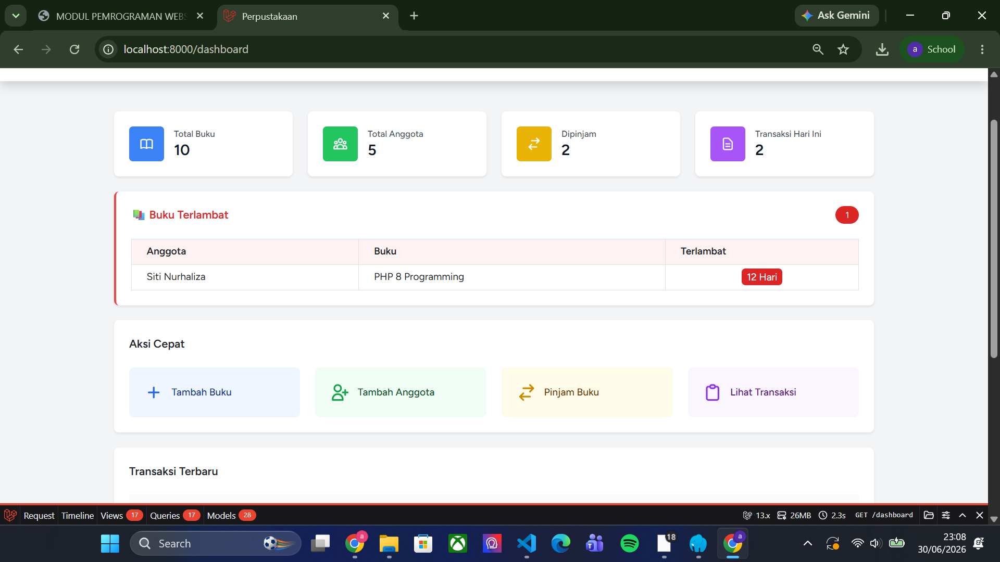
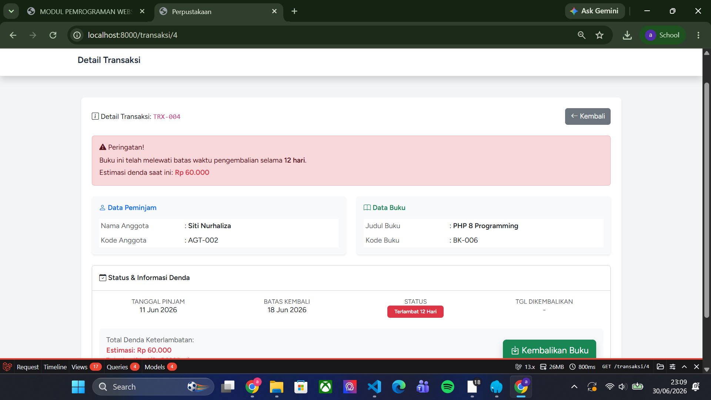

# Tugas Praktikum Pemprograman Web II

## Nama

Nama : Arum Rahma Putri Sabrina

NIM : 60324028

Mata Kuliah : Pemprograman Web II (A)


---

# Tugas 1 - Fitur Pengembalian Buku (40%)

## Fitur

### 1. Detail Transaksi

Pada halaman detail transaksi tersedia tombol **Kembalikan Buku** untuk melakukan proses pengembalian buku.

### 2. Perhitungan Denda

Sistem akan menghitung denda secara otomatis apabila buku dikembalikan melewati batas tanggal kembali.

Ketentuan:

- Denda Rp5.000 per hari
- Tidak ada denda apabila dikembalikan tepat waktu

### 3. Update Status

Setelah buku dikembalikan maka:

- Status berubah menjadi **Dikembalikan**
- Tanggal dikembalikan tersimpan otomatis
- Total denda disimpan ke database

### 4. Update Stok Buku

Saat proses pengembalian berhasil, stok buku otomatis bertambah 1.

## Dokumentasi

### Detail transaksi & tombol kembalikan



### Perhitungan denda



### Status berubah & stok bertambah



---

# Tugas 2 - Laporan Transaksi (30%)

## Halaman Laporan

URL:

```
/transaksi/laporan
```

## Filter

- Range tanggal
- Status transaksi
- Anggota

## Informasi yang ditampilkan

- Daftar transaksi
- Total transaksi
- Total denda

## Export PDF

Laporan dapat diunduh dalam bentuk PDF menggunakan package Laravel DomPDF.

## Dokumentasi

### Halaman laporan transaksi



### Filter laporan



### Download PDF



### Hasil PDF



---

# Tugas 3 - Notifikasi Terlambat (30%)

## Dashboard

Dashboard memiliki widget **Buku Terlambat** yang menampilkan:

- Jumlah transaksi terlambat
- Daftar anggota yang terlambat
- Buku yang dipinjam
- Lama keterlambatan

## Badge Terlambat

Pada halaman daftar transaksi akan muncul badge merah apabila transaksi telah melewati batas pengembalian.

## Reminder

Pada halaman detail transaksi akan muncul peringatan apabila buku sudah melewati batas pengembalian.

## Dokumentasi

### Dashboard Buku Terlambat



### Badge & Reminder Terlambat


